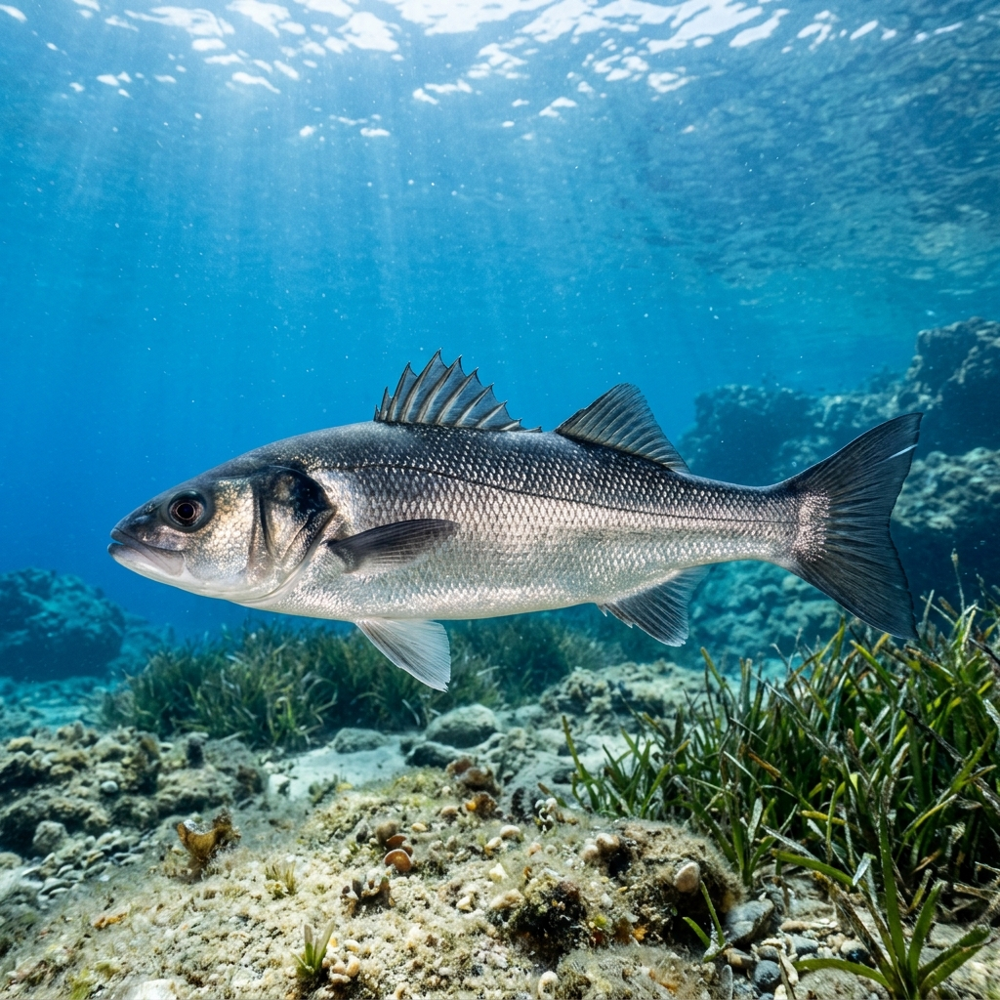
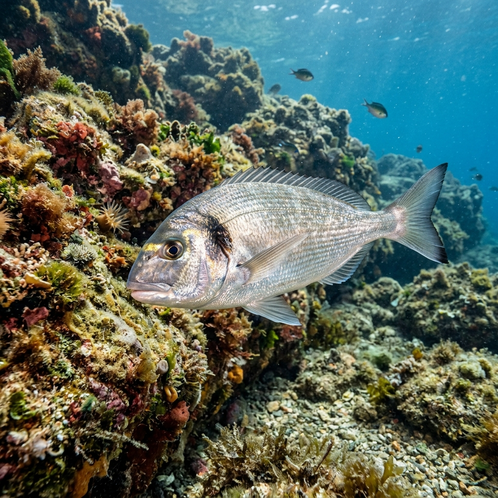
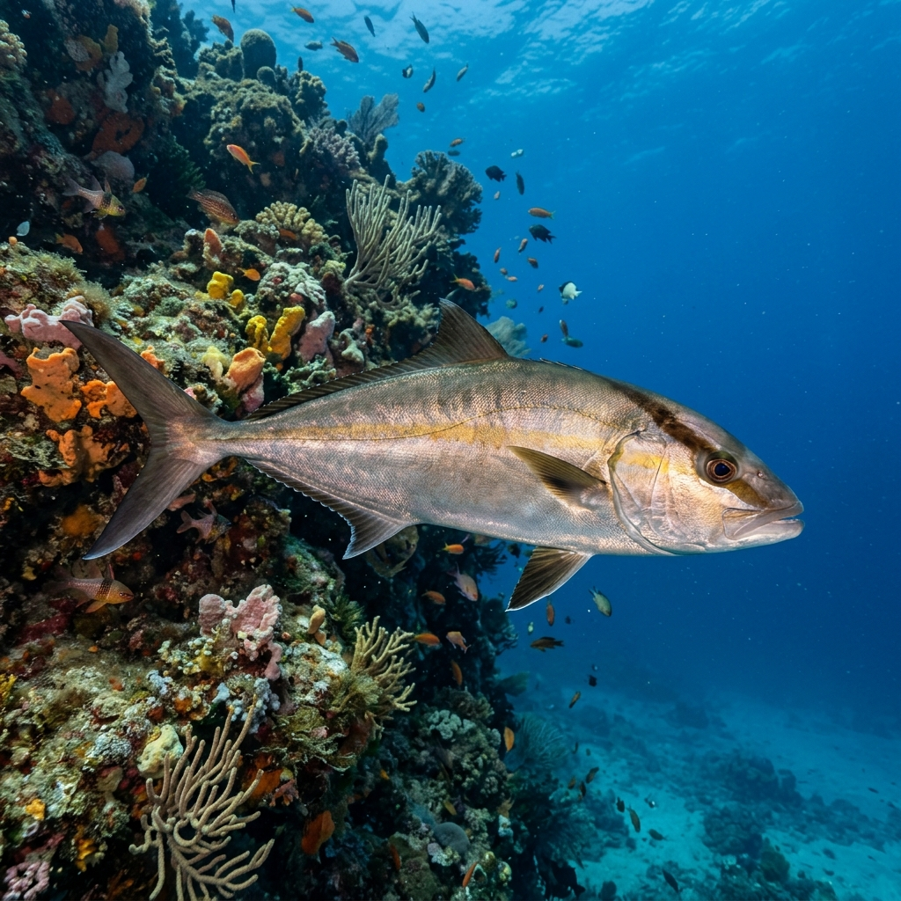
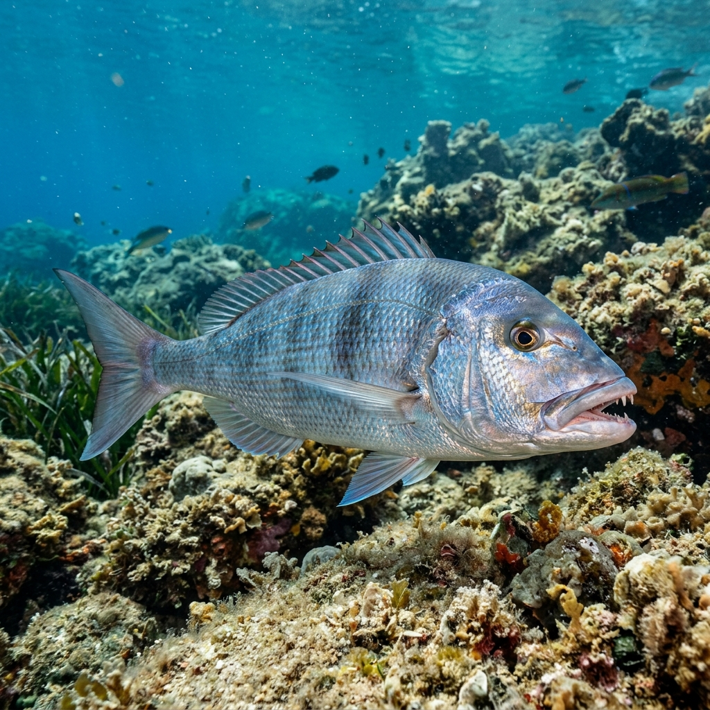

# 🌊 Master Mediterranean Sea Angler & Species Guide

> **Exhaustive Marine Observatory Reference for Mediterranean Fishermen**  
> *Custom Compiled for LUNA GLOW Mediterranean Observatory*

---

## 1. Mediterranean Hydrology & Seasonal Thermal Cycles

Unlike open oceans with multi-meter tidal ranges, the **Mediterranean Sea is a micro-tidal basin** (typical tidal displacement is only 20cm to 40cm). 

Because astronomical tides are small, **fish movement in the Mediterranean is heavily governed by:**
1. **Solunar Moon Transitions (Overhead & Underfoot)** — 3x more influential than in macro-tidal oceans!
2. **Sea Surface Temperature (SST) & Thermocline Layers**
3. **Wind Systems (Mistral, Sirocco, Bora) & Local Current Seams**

---

### 🌡️ Seasonal SST & Fishing Breakdown

#### ❄️ Winter (December – February) | SST: 13°C – 15°C
- **Thermocline:** Disappears; water column is cold and uniform from surface to sea floor.
- **Fish Behavior:** Pelagics migrate deep. Coastal species slow down metabolism.
- **Top Targets:** European Seabass (*Spigola*), Squid (*Calamari*), Cuttlefish (*Seppia*), Deepwater Reef Bream.
- **Best Tactics:** Slow bottom jigging, night squid trolling with egi lures, estuary mouth baiting.

#### 🌸 Spring (March – May) | SST: 16°C – 19°C
- **Thermocline:** Water begins to warm up. Algae blooms spark baitfish migrations.
- **Fish Behavior:** Predators wake up and move from 50m+ depths into shallower coastal reefs (15m–30m).
- **Top Targets:** Common Dentex (*Dentice*), Gilthead Seabream (*Orata*), Cuttlefish.
- **Best Tactics:** Live squid trolling near rocky pinnacles, bottom ledgering with crabs.

#### ☀️ Summer (June – August) | SST: 22°C – 27°C
- **Thermocline:** Strong sharp thermocline forms at 20m–28m depth. Water above is warm, water below stays cool.
- **Fish Behavior:** Fish seek shelter below the thermocline during daytime heat, feeding near surface at dawn, dusk, and Solunar Moon Overhead periods.
- **Top Targets:** Bluefin Tuna (*Tonno Rosso*), Mahi-Mahi (*Lampuga*), White Seabream (*Sarago*), Barracuda.
- **Best Tactics:** Early morning topwater popping, night ledgering for Seabream, deep trolling.

#### 🍂 Autumn (September – November) | ⭐ THE GOLDEN SEASON! | SST: 19°C – 22°C
- **Thermocline:** Water surface cools down slightly, baitfish form massive shoals near the surface.
- **Fish Behavior:** **AGGRESSIVE FEEDING FRENZY!** Predators gorge before winter.
- **Top Targets:** Greater Amberjack (*Ricciola*), Mahi-Mahi (*Lampuga*), Bluefish (*Serra*), Albacore.
- **Best Tactics:** Live bait trolling (squid/sardine), topwater popping, speed jigging.

---

## 2. Mediterranean Species Identification & Fishing Guide

### 🐟 1. European Seabass (*Dicentrarchus labrax* | Spigola / Branzino)

- **Identification:** Sleek silver body, dark grey/blue back, two distinct dorsal fins with sharp spines, dark spot on gill cover.
- **Best Season:** **Autumn & Winter (October – February)**.
- **Ideal Water Temp:** 14°C – 18°C.
- **Habitat:** Shallow rocky coastlines, estuary river mouths, harbor walls, surf zones.
- **Behavior:** Ambush predator that loves turbulent white water caused by onshore winds.
- **Top Baits & Lures:** Live prawns, live mullet, 120mm minnow plugs, soft plastic sand eels.

---

### 🐟 2. Gilthead Seabream (*Sparus aurata* | Orata)

- **Identification:** Oval silver-grey body, iconic bright golden bar between eyes, reddish spot on gill cover, powerful crushing jaws.
- **Best Season:** **Late Spring to Autumn (May – October)**.
- **Ideal Water Temp:** 18°C – 24°C.
- **Habitat:** Sandy bays, seagrass beds (*Posidonia*), shellfish beds, rocky reef margins.
- **Behavior:** Skittish bottom feeder that crushes crabs, mussels, and sea urchins.
- **Top Baits & Lures:** Live beach crabs, bibi worms, razor clams, fresh mussel flesh.

---

### 🐟 3. Greater Amberjack (*Seriola dumerili* | Ricciola)

- **Identification:** Large hydrodynamic amber-silver body, dark diagonal stripe passing through the eye to dorsal fin, yellow-brown lateral band.
- **Best Season:** **Autumn (September – November)**.
- **Ideal Water Temp:** 19°C – 23°C.
- **Habitat:** Deep underwater pinnacles, drop-offs (30m–100m), offshore wrecks, steep capes.
- **Behavior:** High-speed apex predator that attacks in packs near deep reefs.
- **Top Baits & Lures:** Live squid, live garfish, 150g–250g vertical metal jigs, deep trolled live bait.

---

### 🐟 4. Common Dentex (*Dentex dentex* | Dentice)

- **Identification:** High-backed metallic blue/pink body with small dark blue spots, prominent sharp canine teeth in front jaws.
- **Best Season:** **Spring (May – June) & Autumn (September – October)**.
- **Ideal Water Temp:** 17°C – 21°C.
- **Habitat:** Steep rocky cliffs, isolated reef bommies at 15m–50m depths.
- **Behavior:** The "King of the Mediterranean Reef." Solitary territorial hunter that strikes with extreme force.
- **Top Baits & Lures:** Live octopus, live squid, inchiku jigs, slow pitch jigs.

---

## 3. Mediterranean Wind Systems & Fishing Impact

1. **Mistral (North-West Wind):**
   - Cold, dry wind blowing from France across the Western Mediterranean.
   - **Impact:** Cools warm surface waters, creates rough white water along northern shores. **Triggers massive Seabass feeding frenzies!**
2. **Sirocco (South-East Wind):**
   - Warm, humid wind originating from Sahara Desert.
   - **Impact:** Pushes warm water and surface plankton into northern bays, creating excellent night fishing conditions for Seabream and Amberjack.
3. **Bora (North-East Wind):**
   - Fierce cold wind across Adriatic and Aegean Seas.
   - **Impact:** Target sheltered lee-sides of islands and deep drop-offs.

---
*LUNA GLOW Mediterranean Observatory Guide v3.0 — Master Marine Knowledge Base*
